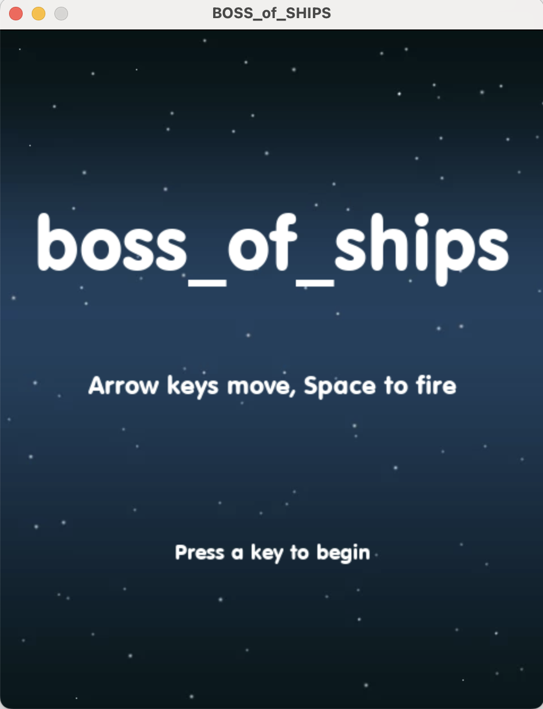
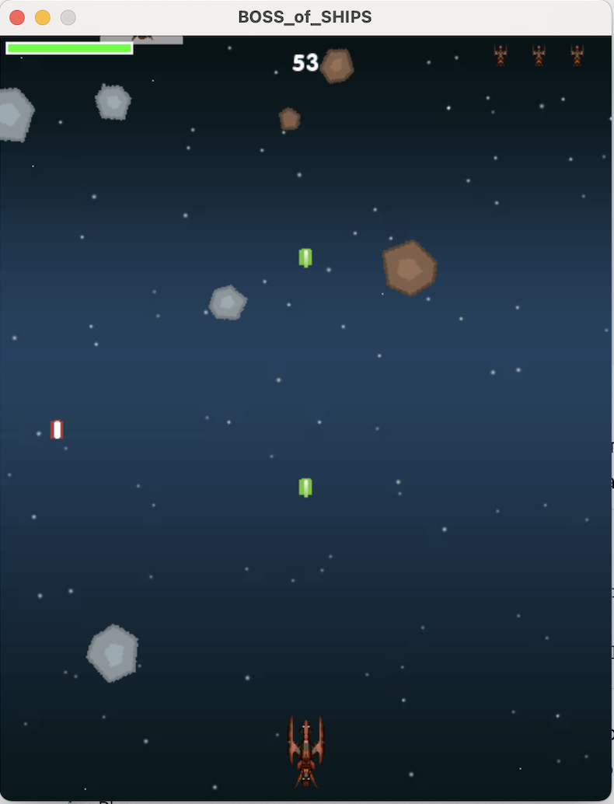

# BOSS of SHIPS

**BOSS of SHIPS** is a space arcade game where the player controls a spaceship that navigates through space, dodging asteroids and enemy ships. The goal is to survive as long as possible by avoiding obstacles and shooting down enemies with a laser. The player has three lives, displayed at the top right of the screen.

## Game Description

In this game, your ship travels through space, encountering asteroids and enemy ships. You can shoot a laser to destroy obstacles and enemies. If the ship collides with an asteroid or enemy ship, the player loses one life. The game ends when all three lives are lost.

### Key Features

- Control the spaceship using arrow keys.
- Shoot laser beams to destroy asteroids and enemy ships.
- Three lives displayed in the top right corner of the screen.
- Score counter increases as you destroy enemies.

## Screenshots

<div style="display: flex; justify-content: center;">
  
  
</div>

## Requirements

- Python 3.x
- Pygame 2.x

## Installation

1. Make sure Python 3 is installed. To check, run:
   ```bash
   python3 --version
2. Install the pygame library if it's not already installed:
    ```bash
    pip3 install pygame

## Running the Game

Clone the repository to your local machine:
git clone <repository-url>
cd boss_of_ships
Run the game with the following command:
python3 game_cycle_union.py

## Controls

Arrow Keys — control the movement of the ship.
Space — fire the laser.

## Project Structure

game_cycle_union.py — main file to start the game.
img/ — folder containing images used in the game, including ships, asteroids, and backgrounds.
img/explosion/ — explosion animations.
img/meteors/ — asteroid images.
snd/ — sound files for shooting, explosions, and background music.
font/ — font used for text in the game.

## Notes

This game was created as a project to practice Python programming and working with the Pygame library. The game has basic mechanics and is intended as a learning project. It could be expanded with additional levels, enemies, and power-ups.

## Acknowledgments

Pygame community for their support and resources.
All image and sound assets were sourced from open resources for educational use in this project.


